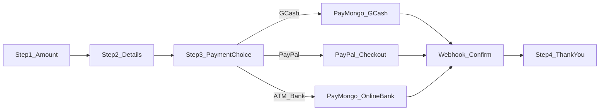

# Add GCash, PayPal, and ATM Payment Choices to Donate Page

## Current state

The donate flow is **frontend-only** ([`resources/views/donate.blade.php`](resources/views/donate.blade.php) + [`public/js/donate.js`](public/js/donate.js)):

- Step 1: amount
- Step 2: donor details
- Step 3: credit card fields (no real processing)
- Step 4: thank-you (Alpine sets `step = 4` locally)

There is **no** payment controller, donation model, or gateway config today.

## Target flow



**Step 3 changes:** remove credit card UI; add a 3-option toggle (GCash | PayPal | ATM/Bank) matching the existing `.donate-freq` pill style, with method-specific panels below.

**Step 4:** shown only after a **verified** successful payment (return URL + webhook), not on button click alone.

## Payment architecture

| Method         | Gateway                   | Currency                   | How it works                                                                                                         |
| -------------- | ------------------------- | -------------------------- | -------------------------------------------------------------------------------------------------------------------- |
| **PayPal**     | PayPal Orders v2 API      | USD (matches current page) | Create order on backend → redirect to PayPal → capture on return → webhook confirms                                  |
| **GCash**      | PayMongo Checkout Session | PHP                        | Create checkout session with `payment_method_types: ['gcash']` → redirect to PayMongo hosted page                    |
| **ATM / Bank** | PayMongo Checkout Session | PHP                        | Same API with `payment_method_types: ['dob', 'brankas']` for BPI, UnionBank, BDO, Metrobank, Landbank online banking |

**Note on “ATM”:** true cash-in at an ATM cannot be automated via API. In the Philippines, “bank/ATM payment” online usually means **direct online banking** (login to your bank app/site). We will label the UI **“Bank / Online Banking”** with a short note that users pay through their bank portal—not a physical ATM deposit slip flow.

**Currency handling:** GCash and bank methods require **PHP**. Keep USD as the primary display currency; convert at checkout using a configurable rate in `.env` (e.g. `DONATION_USD_TO_PHP=58.00`) and show the PHP equivalent on Step 3 before redirect.

## Merchant account setup (you’ll need these)

### 1. PayPal (for PayPal donations)

1. Go to [https://developer.paypal.com](https://developer.paypal.com) and create a developer account.
2. Create a **Sandbox Business** app → copy **Client ID** and **Secret**.
3. Create a **Sandbox Personal** buyer account for testing.
4. When ready for live: create a **Live** app in the PayPal dashboard and swap credentials.

### 2. PayMongo (for GCash + online banking)

1. Sign up at [https://dashboard.paymongo.com](https://dashboard.paymongo.com).
2. Complete business verification (required for live GCash/bank).
3. Copy **Test Public Key** and **Test Secret Key** from Developers → API Keys.
4. In Dashboard → **Webhooks**, add endpoint `https://your-domain.com/webhooks/paymongo` and subscribe to `checkout_session.payment.paid`.
5. For live: switch to live keys after verification.

No separate GCash merchant signup is needed—PayMongo acts as the licensed aggregator.

## Backend work

### New files

| File                                                         | Purpose                                   |
| ------------------------------------------------------------ | ----------------------------------------- |
| `database/migrations/..._create_donations_table.php`         | Store donation attempts and status        |
| `app/Models/Donation.php`                                    | Eloquent model                            |
| `app/Http/Controllers/DonationController.php`                | Create checkout, handle returns           |
| `app/Http/Controllers/Webhook/PayPalWebhookController.php`   | Verify PayPal events                      |
| `app/Http/Controllers/Webhook/PayMongoWebhookController.php` | Verify PayMongo events                    |
| `app/Services/PayPalDonationService.php`                     | Orders create/capture                     |
| `app/Services/PayMongoDonationService.php`                   | Checkout session create                   |
| `config/donation.php`                                        | USD→PHP rate, platform fee, allowed banks |

### `donations` table (essential columns)

- `uuid` (public reference)
- Donor fields from Step 2 (`first_name`, `last_name`, `email`, address, etc.)
- `amount_usd`, `amount_php`, `platform_fee_usd`
- `frequency` (`once` / `monthly` — store for now; recurring can be phase 2)
- `payment_method` (`gcash`, `paypal`, `bank`)
- `status` (`pending`, `paid`, `failed`, `cancelled`)
- Gateway IDs: `paypal_order_id`, `paymongo_session_id`, `paymongo_payment_id`

### Routes ([`routes/web.php`](routes/web.php))

```php
Route::post('/donate/checkout', [DonationController::class, 'checkout'])->name('donate.checkout');
Route::get('/donate/success/{donation}', [DonationController::class, 'success'])->name('donate.success');
Route::get('/donate/cancel/{donation}', [DonationController::class, 'cancel'])->name('donate.cancel');

// Webhooks — exclude from CSRF in bootstrap/app.php or VerifyCsrfToken
Route::post('/webhooks/paypal', [PayPalWebhookController::class, 'handle']);
Route::post('/webhooks/paymongo', [PayMongoWebhookController::class, 'handle']);
```

### Packages to install

```bash
composer require srmklive/paypal
```

PayMongo: use direct HTTP via Laravel `Http` facade (no extra package required; keeps dependencies minimal). Optional: `kirame09/laravel-paymongo` if you prefer a wrapper.

### Env vars ([`.env.example`](.env.example))

```
PAYPAL_MODE=sandbox
PAYPAL_SANDBOX_CLIENT_ID=
PAYPAL_SANDBOX_CLIENT_SECRET=
PAYPAL_LIVE_CLIENT_ID=
PAYPAL_LIVE_CLIENT_SECRET=

PAYMONGO_PUBLIC_KEY=
PAYMONGO_SECRET_KEY=
PAYMONGO_WEBHOOK_SECRET=

DONATION_USD_TO_PHP=58.00
```

Also add PayPal config to [`config/services.php`](config/services.php) and publish/configure `config/paypal.php` from the package.

## Frontend work

### [`resources/views/donate.blade.php`](resources/views/donate.blade.php) — Step 3 rewrite

Replace lines ~277–353 (card form) with:

1. **Payment method toggle** — 3 buttons bound to `paymentMethod` (`gcash` | `paypal` | `bank`):
   - Reuse `.donate-freq` pattern; add CSS variant `.donate-freq--3col` for 3 equal columns.
   - Include small brand labels/icons (GCash blue, PayPal blue, bank icon).

2. **Conditional panels** (`x-show`):
   - **GCash:** amount summary (USD + PHP), short instructions (“You’ll be redirected to GCash to complete payment”), primary CTA.
   - **PayPal:** amount in USD, PayPal-branded CTA.
   - **Bank:** amount summary, note about supported banks (BPI, BDO, Metrobank, Landbank, UnionBank), CTA.

3. **Remove** card number / expiry / CVC fields entirely.

4. **Submit:** change `@click="submit()"` to POST donor + amount + `payment_method` to `/donate/checkout` (form submit or `fetch` + redirect to gateway URL).

5. **Step 4 trigger:** when user lands on `/donate/success/{uuid}` with `status=paid`, pass `paid=true` from controller so Alpine opens Step 4 with the confirmed amount.

### [`public/js/donate.js`](public/js/donate.js)

- Add `paymentMethod: 'gcash'` (default).
- Replace `step3Valid()` — always valid once a method is selected (validation happens server-side).
- Replace `submit()` — build payload from `form`, `effectiveAmount`, `platformFee`, `paymentMethod`, POST to checkout route.
- Remove `card`, `formatCard`, `formatExpiry`.
- Add computed `amountPhp` using rate injected from Blade: `x-data="donateApp({ usdToPhp: {{ config('donation.usd_to_php') }} })"`.

### [`resources/css/pages/donate.css`](resources/css/pages/donate.css)

- `.donate-freq--3col { grid-template-columns: 1fr 1fr 1fr; }`
- `.donate-pay-panel` — bordered info box for method-specific copy
- `.donate-pay-method-icon` — small logos
- Mobile: stack 3 buttons vertically under 480px

## Security and reliability

- Validate Step 2 fields server-side in `DonationController@checkout` (Form Request).
- Never trust client amount alone — recompute total server-side.
- Mark donation `paid` only after PayPal capture success **or** PayMongo webhook `checkout_session.payment.paid`.
- Verify PayMongo webhook signature; verify PayPal webhook signature.
- Use `uuid` in URLs instead of numeric IDs.

## Testing plan

1. **PayPal sandbox:** $25 donation → approve with sandbox buyer → land on success page → Step 4 shows.
2. **PayMongo GCash test:** ₱ equivalent → PayMongo test checkout → authorize → webhook marks paid.
3. **PayMongo bank test:** select BDO test flow → OTP `123456` → success.
4. **Cancel flows:** user cancels on gateway → `/donate/cancel/{uuid}` shows retry option.
5. **Mobile:** 3-button toggle readable on small screens.

## Out of scope (future phase)

- Monthly recurring donations (PayPal Subscriptions)
- Admin dashboard to list donations
- Email receipts (can hook into existing Laravel mail config later)
- Physical ATM / OTC cash deposit with manual proof upload

## Files to touch (summary)

- [`resources/views/donate.blade.php`](resources/views/donate.blade.php) — Step 3 UI + inject config
- [`public/js/donate.js`](public/js/donate.js) — payment method state + checkout POST
- [`resources/css/pages/donate.css`](resources/css/pages/donate.css) — 3-option toggle styles
- [`routes/web.php`](routes/web.php) — new routes
- [`.env.example`](.env.example) — gateway keys
- New: migration, model, controller, services, config, webhook controllers
